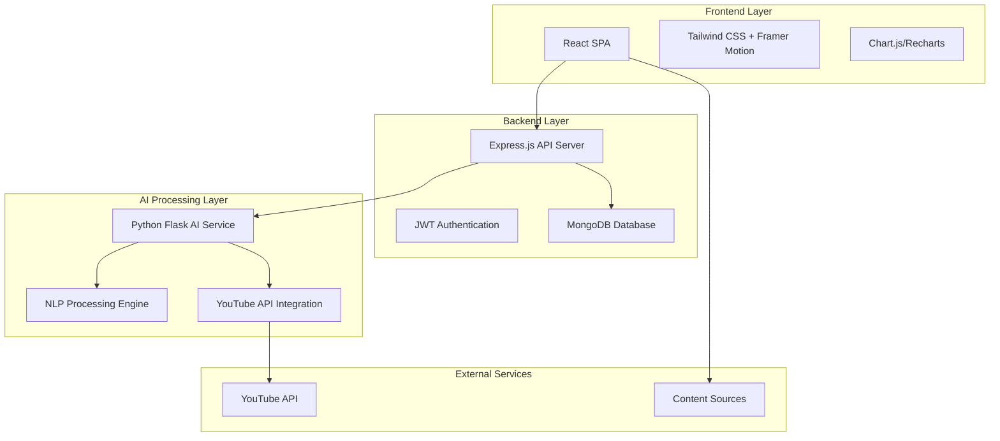

# Design Document

## Overview

FocusAI is a full-stack web application built with a microservices architecture consisting of a React frontend, Node.js/Express backend, and Python Flask AI service. The system processes content from various sources, applies machine learning algorithms for classification and summarization, and provides users with productivity analytics through a premium SaaS interface.

The application follows a three-tier architecture: presentation layer (React SPA), business logic layer (Express API), and data layer (MongoDB + AI processing service). This separation enables independent scaling, maintainability, and clear separation of concerns.

## Architecture

### System Architecture



### Technology Stack

**Frontend:**
- React.js 18+ with functional components and hooks
- Tailwind CSS for utility-first styling
- Framer Motion for animations and micro-interactions
- Chart.js or Recharts for data visualization
- Axios for HTTP client communication

**Backend:**
- Node.js with Express.js framework
- MongoDB with Mongoose ODM
- JWT for authentication and session management
- bcrypt for password hashing
- CORS middleware for cross-origin requests

**AI Service:**
- Python Flask lightweight web framework
- scikit-learn for machine learning algorithms
- NLTK/spaCy for natural language processing
- youtube-transcript-api for video content extraction
- TF-IDF vectorization for content analysis

## Components and Interfaces

### Frontend Components

**Core Layout Components:**
- `App.js`: Main application router and global state management
- `Layout.js`: Common layout wrapper with navigation and theming
- `ProtectedRoute.js`: Authentication guard for protected pages

**Page Components:**
- `LandingPage.js`: Marketing page with hero section and feature showcase
- `LoginPage.js` / `SignupPage.js`: Authentication forms with validation
- `Dashboard.js`: Main analytics dashboard with productivity metrics
- `ContentAnalyzer.js`: Content input and analysis results interface
- `Recommendations.js`: AI-generated content suggestions
- `FocusMode.js`: Pomodoro timer and distraction blocking interface

**Shared UI Components:**
- `Button.js`: Reusable button with variants (primary, secondary, ghost)
- `Card.js`: Glassmorphism card container with consistent styling
- `LoadingSpinner.js`: Animated loading indicator
- `Toast.js`: Notification system for user feedback
- `ProgressBar.js`: Circular and linear progress indicators
- `Chart.js`: Wrapper components for data visualization

### Backend API Endpoints

**Authentication Routes:**
```javascript
POST /api/auth/register
POST /api/auth/login
POST /api/auth/logout
GET /api/auth/me
```

**Content Analysis Routes:**
```javascript
POST /api/analyze
GET /api/analyze/history
GET /api/analyze/:id
DELETE /api/analyze/:id
```

**User Analytics Routes:**
```javascript
GET /api/analytics/dashboard
GET /api/analytics/productivity-score
GET /api/analytics/time-tracking
GET /api/analytics/content-breakdown
```

**Recommendations Routes:**
```javascript
GET /api/recommendations
POST /api/recommendations/feedback
GET /api/recommendations/categories
```

### AI Service Interface

**Content Processing Endpoints:**
```python
POST /ai/analyze-text
POST /ai/analyze-youtube
POST /ai/summarize
POST /ai/classify
GET /ai/health
```

**Request/Response Schemas:**
```javascript
// Analysis Request
{
  "content": "string",
  "type": "text|youtube",
  "userId": "string"
}

// Analysis Response
{
  "summary": "string",
  "score": "number (0-100)",
  "category": "Useful|Neutral|Waste",
  "keywords": ["string"],
  "processingTime": "number",
  "confidence": "number"
}
```

## Data Models

### User Model
```javascript
{
  _id: ObjectId,
  email: String (unique, required),
  password: String (hashed, required),
  name: String (required),
  preferences: {
    theme: String (default: "dark"),
    notifications: Boolean (default: true),
    focusSessionLength: Number (default: 25)
  },
  analytics: {
    totalAnalyses: Number (default: 0),
    productivityScore: Number (default: 0),
    timeSpent: {
      useful: Number (default: 0),
      waste: Number (default: 0)
    }
  },
  createdAt: Date,
  updatedAt: Date
}
```

### Content Analysis Model
```javascript
{
  _id: ObjectId,
  userId: ObjectId (ref: User),
  content: {
    original: String (required),
    type: String (enum: ["text", "youtube"]),
    url: String (optional)
  },
  analysis: {
    summary: String (required),
    score: Number (0-100, required),
    category: String (enum: ["Useful", "Neutral", "Waste"]),
    keywords: [String],
    confidence: Number (0-1)
  },
  metadata: {
    processingTime: Number,
    contentLength: Number,
    language: String (default: "en")
  },
  createdAt: Date
}
```

### Focus Session Model
```javascript
{
  _id: ObjectId,
  userId: ObjectId (ref: User),
  session: {
    duration: Number (minutes),
    completed: Boolean,
    type: String (enum: ["pomodoro", "custom"]),
    breaks: Number (default: 0)
  },
  productivity: {
    distractionsBlocked: Number (default: 0),
    focusScore: Number (0-100)
  },
  createdAt: Date
}
```

### Recommendation Model
```javascript
{
  _id: ObjectId,
  userId: ObjectId (ref: User),
  recommendation: {
    title: String (required),
    description: String (required),
    category: String (enum: ["Learning", "Entertainment", "Skill-based"]),
    score: Number (0-100),
    tags: [String],
    source: String,
    url: String (optional)
  },
  interaction: {
    viewed: Boolean (default: false),
    liked: Boolean (default: false),
    dismissed: Boolean (default: false)
  },
  createdAt: Date
}
```

## Correctness Properties

*A property is a characteristic or behavior that should hold true across all valid executions of a system—essentially, a formal statement about what the system should do. Properties serve as the bridge between human-readable specifications and machine-verifiable correctness guarantees.*

Before defining the correctness properties, I need to analyze the acceptance criteria to determine which ones are testable as properties, examples, or edge cases.

### Content Analysis Properties

**Property 1: Content analysis completeness**
*For any* valid content input (text or YouTube URL), the analysis response should contain a summary, usefulness score (0-100%), and category classification (Useful/Neutral/Waste)
**Validates: Requirements 1.1, 1.3, 1.4, 6.3, 9.2, 10.1, 10.2, 10.3**

**Property 2: YouTube transcript extraction**
*For any* valid YouTube URL, the system should successfully extract transcript content and process it for analysis
**Validates: Requirements 1.2**

**Property 3: Analysis performance timing**
*For any* content input under specified size limits, analysis should complete within the defined time constraints (10 seconds for text under 10,000 characters, 5 seconds for typical content)
**Validates: Requirements 1.5, 12.2**

### Authentication and Session Properties

**Property 4: User registration round-trip**
*For any* valid registration data, creating an account and then authenticating should grant access to protected routes
**Validates: Requirements 4.2, 4.3**

**Property 5: Authentication error handling**
*For any* invalid credentials, the authentication system should reject access and display appropriate error messages
**Validates: Requirements 4.4**

**Property 6: Session persistence**
*For any* authenticated user session, browser refresh should maintain authentication state without requiring re-login
**Validates: Requirements 4.5**

### User Interface and Experience Properties

**Property 7: Dashboard data completeness**
*For any* authenticated user, the dashboard should display all required elements: welcome header, productivity score, time metrics, daily insights, charts, and recent content list
**Validates: Requirements 5.1, 5.2, 5.3, 5.4, 5.5, 5.6**

**Property 8: UI feedback consistency**
*For any* user interaction requiring processing time, the interface should provide appropriate loading indicators, animations, and completion notifications
**Validates: Requirements 6.2, 11.3, 11.5**

**Property 9: Typography and layout consistency**
*For any* page in the application, the interface should use specified fonts (Inter/Poppins) and maintain responsive grid layout across different screen sizes
**Validates: Requirements 2.4, 2.5**

### Content Processing and Storage Properties

**Property 10: Analysis persistence**
*For any* successful content analysis, the results should be automatically saved to the user's history and retrievable in future sessions
**Validates: Requirements 6.5, 9.4**

**Property 11: Input validation and error handling**
*For any* invalid input (empty content, malformed URLs, oversized content), the system should prevent processing and display specific error messages
**Validates: Requirements 6.4, 11.1, 11.2**

### Recommendations and Focus Mode Properties

**Property 12: Recommendation generation**
*For any* user with sufficient analysis history, the system should generate personalized recommendations containing title, description, score, and tags in card layout
**Validates: Requirements 7.1, 7.3**

**Property 13: Recommendation interaction tracking**
*For any* user feedback on recommendations, the system should update future recommendation algorithms based on interaction patterns
**Validates: Requirements 7.5**

**Property 14: Focus session tracking**
*For any* focus mode session (started, paused, completed), the system should track statistics and provide appropriate notifications
**Validates: Requirements 8.3, 8.4, 8.5**

### System Performance and Integration Properties

**Property 15: API service integration**
*For any* content processing request, the API should successfully communicate with the Python Flask AI service and handle service failures gracefully
**Validates: Requirements 9.3, 9.5, 10.5**

**Property 16: System performance under load**
*For any* concurrent user requests, the system should maintain response times and handle multiple users without performance degradation
**Validates: Requirements 12.1, 12.3**

**Property 17: Service availability error handling**
*For any* API service unavailability, the dashboard should display appropriate loading states and error recovery options
**Validates: Requirements 11.4**

## Error Handling

### Frontend Error Handling Strategy

**Input Validation:**
- Client-side validation for all form inputs before API calls
- Real-time validation feedback with specific error messages
- Prevention of invalid data submission through UI controls

**Network Error Handling:**
- Retry logic for failed API requests with exponential backoff
- Offline detection and appropriate user messaging
- Graceful degradation when services are unavailable

**User Experience Errors:**
- Toast notification system for operation feedback
- Loading states during asynchronous operations
- Clear error messages with actionable recovery steps

### Backend Error Handling Strategy

**API Error Responses:**
```javascript
// Standardized error response format
{
  "error": {
    "code": "VALIDATION_ERROR",
    "message": "Invalid YouTube URL format",
    "details": {
      "field": "url",
      "value": "invalid-url"
    },
    "timestamp": "2024-01-15T10:30:00Z"
  }
}
```

**Database Error Handling:**
- Connection pooling with automatic reconnection
- Transaction rollback for failed operations
- Data validation at model level with descriptive errors

**AI Service Integration Errors:**
- Circuit breaker pattern for AI service failures
- Fallback responses when AI processing is unavailable
- Request queuing during high load periods

### AI Service Error Handling

**Content Processing Errors:**
- Timeout handling for long-running analysis
- Fallback classification when ML models fail
- Graceful handling of unsupported content types

**YouTube API Integration:**
- Rate limiting compliance with exponential backoff
- Alternative transcript sources when primary fails
- Content availability validation before processing

## Testing Strategy

### Dual Testing Approach

The testing strategy employs both unit testing and property-based testing to ensure comprehensive coverage:

**Unit Testing Focus:**
- Specific examples demonstrating correct behavior
- Edge cases and boundary conditions
- Integration points between components
- Error conditions and exception handling
- Component rendering and user interactions

**Property-Based Testing Focus:**
- Universal properties that hold for all inputs
- Comprehensive input coverage through randomization
- Correctness validation across diverse data sets
- Performance characteristics under varied conditions

### Testing Framework Configuration

**Frontend Testing:**
- Jest and React Testing Library for component testing
- Cypress for end-to-end user flow testing
- Storybook for component documentation and visual testing

**Backend Testing:**
- Jest for API endpoint testing
- Supertest for HTTP request testing
- MongoDB Memory Server for isolated database testing

**Property-Based Testing:**
- fast-check library for JavaScript property testing
- Minimum 100 iterations per property test
- Each property test tagged with: **Feature: focusai-content-filtering, Property {number}: {property_text}**

**AI Service Testing:**
- pytest for Python unit testing
- Hypothesis for property-based testing in Python
- Mock external API dependencies for consistent testing

### Test Coverage Requirements

**Unit Test Coverage:**
- Minimum 80% code coverage for all modules
- 100% coverage for critical authentication and data processing paths
- Comprehensive error condition testing

**Property Test Coverage:**
- Each correctness property implemented as a single property-based test
- Performance properties tested with realistic data volumes
- Integration properties tested across service boundaries

**End-to-End Testing:**
- Complete user workflows from registration to content analysis
- Cross-browser compatibility testing
- Mobile responsiveness validation
- Performance testing under realistic load conditions

### Continuous Integration

**Automated Testing Pipeline:**
- All tests run on every pull request
- Property tests configured with deterministic seeds for reproducibility
- Performance regression testing with baseline metrics
- Security vulnerability scanning for dependencies

**Quality Gates:**
- All tests must pass before deployment
- Code coverage thresholds enforced
- Performance benchmarks validated
- Security scan results reviewed